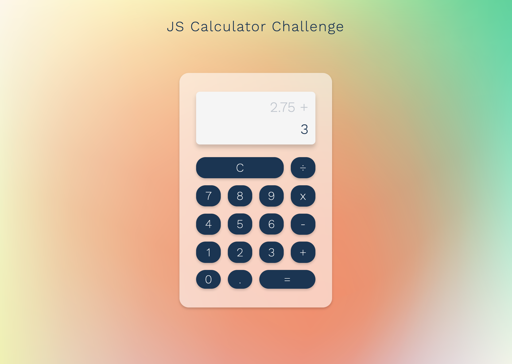

# JS Calculator

> To build a calculator using HTML, CSS and JavaScript. This calculator should accept inputs from a user, is able to perform a range of calculations and will produce a visual output.
>  
> Project Link [_here_](https://amiehannah.github.io/js-calculator/).

##

## User Story:

- As a user of the calculator, I want to be able to perform maths calculations,
  so that I can solve numerical problems accurately.
- Given that the user clicks on a number button, this number should then be stored to be used in calculations.
- Given that the user clicks on an operand button ( + , - , / , \* ) this should trigger the correct operator to be used in calculations.
- Given that the user clicks on the decimal button, this should add a decimal point at the correct position and allow the user to calculate numbers that are fractions.
- Given that the user clicks on the equals button, this should evaluate the sum and return a total value.
- Given that the user clicks on the clear button, the calculator values and display should reset, ready to be used again.

## Functionality:

Essential functionality needed:
 

- Addition
- Subtraction
- Division
- Multiplication
- Clear/reset the display
- Visually display the answer / output
- Work with decimals

Breaking down the problem:
 

- Listens out for buttons pressed from a user and displays these
- Store this number to be used in calculations
- User then selects an operator button
- Listens for the next set of number buttons selected
- When the user clicks equals - this needs to perform the maths and return a total value
- When the user clicks clear - the calculator needs to reset

Approach:

1. First I started by selecting all the elements I needed to target in variables. I initially saved each number/operator into individual variables before changing my approach. Instead by using querySelectorAll on numberBtns and operatorBtns (to select these elements) I realised I can later iterate over them, as this returns a node list and will be far more useful in some of the functionality.

2. The array iterator I used to loop over the numberBtns/operatorBtns was forEach(). By adding an event listener, listening out for the click event I was able to capture the value of these buttons.
     For the number buttons I stored the number selected inside a variable to use later in the calculations. I then updated the display of the calculator to reflect the chosen firstValue.

3. After the firstValue has been selected, I then set up an event listener to capture the value of the operator clicked by the user.

4. One part of the functionality of my design was to create a calculator display split into two parts to allow the user to see the previous value and operator, or sum they had entered whilst performing calculations.  
   Once the firstValue has been selected and an operator, update the innerHTML of the top display to show these values. At this stage the firstValue number is then stored within a variable called storedValue and the firstValue is set to blank, to accept the next value chosen by the user.
     The bottom display will show the sum of the calculation.

5. Calculate total functionality
    
   I used an if/else if statement to work through the operators and return the value computed by the operator selected. Then updating the calculator display with the sum. I then reset the variables used to store my number values to allow the user to make additional calculations should they wish to.

6. Clear button functionality
    
   On pressing the clear button all variables are reset and the display is cleared, ready for the next user.

7. Decimal button functionality
    
   To prevent the user from adding more than one decimal point, I have added an event listener and used the js string method 'includes'(".") to determine whether the firstValue includes this character and if so only add one.

## Technologies & Features:

- JavaScript
- HTML5
- CSS
- Mobile first / responsive design
- UI - features unique mesh gradient background I created in Adobe Illustrator.

## Further Developments:

- Integrate keyboard events, to allow the users interaction with numeric keys to select inputs and operands - instead of just clicking on the buttons.

## Contact

Created by [Amie Edwards](mailto:amie.edwards17@gmail.com)
